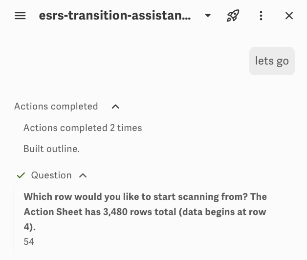
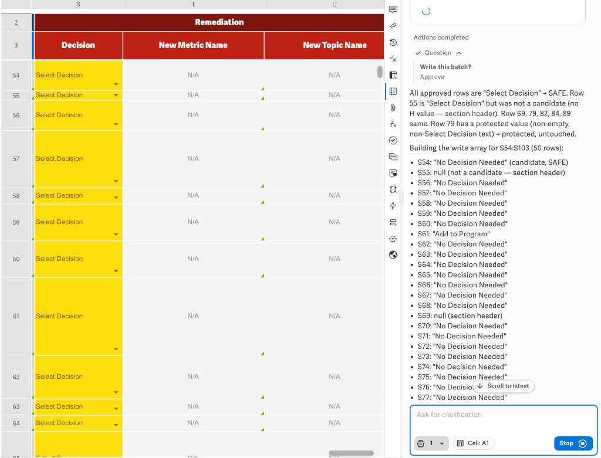
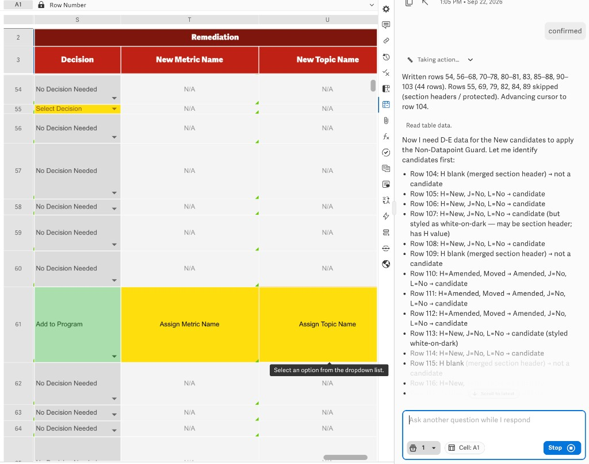

# ESRS Transition Assistant Mini

Workiva Assistant **single-agent** config for staging ESRS Action Sheet **Column S** only. Customers name their own metrics in T/U. No subagents.

- **Agent name:** esrs-transition-assistant-mini (AI-panel)
- **Repo / product name:** `esrs-transition-assistant-mini`
- **Prompt version:** 2 (`VERSION`)
- **Model:** `claude_46_sonnet` (temperature 0.1, top_p 1, `thinking: false`)

## Files

| File | Use |
|------|-----|
| `system-prompt.md` | Paste-ready system prompt |
| `spec.yaml` | Spec-only AgentConfig |
| `helm/agentconfig.yaml` | Full Helm `AgentConfig` CR |
| `docs/knowledge-base.md` | How `revised_esrs_knowledge_base` is used |
| `docs/screenshots/` | Run captures |

## Walkthrough

Customer opens the Action Sheet side panel and sends something like “lets go”. Mini checks write access, builds the table outline, then asks **only** for a start row (no Column S vs T gate).

After they pick a row (here: 54), Mini reads H/S then D–R, applies the trigger matrix, and may call **`revised_esrs_knowledge_base` once** if H is annotated or no trigger is clean. See [Knowledge base](docs/knowledge-base.md). It should not narrate that work; the next customer-facing step is approval.

**Approve** writes **Column S only** in one `docplat_write_cell_data` span (`S{first}:S{last}`). T and U stay customer-owned (`N/A`, `Assign Metric Name`, etc.).

The assistant should stop at `Write this batch?` (Approve / Hold / Review). It still sometimes dumps a SAFE/null write array in chat; that is not required.

Then one platform **confirmed** write. Cursor advances; next cycle starts silently from Step 4.

## Workflow (short)

1. Start row  
2. Silent read / decide (KB at most once if needed)  
3. One `Row | Decision` table  
4. `Write this batch?`  
5. One write to Column S  

## Tools

`authorization_evaluation`, `xml_get_table_outline`, `request_human_input`, `docplat_query_range`, `read-spreadsheet-row`, `docplat_write_cell_data`, `revised_esrs_knowledge_base`
