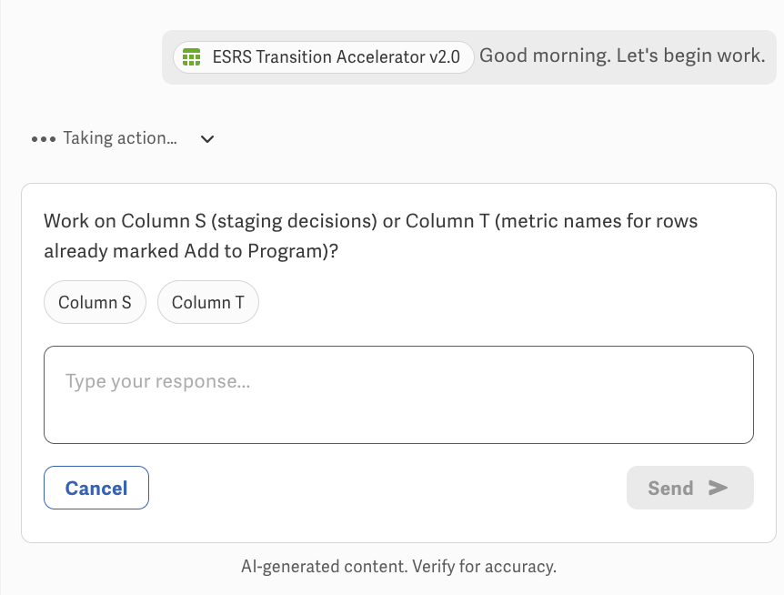
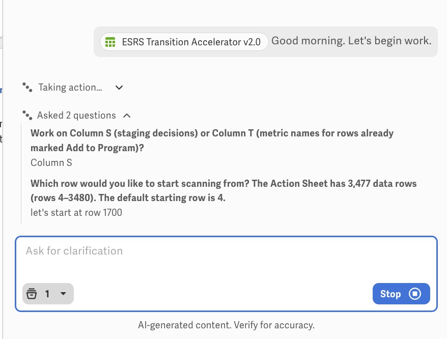

# ESRS Transition Assistant Mini

Workiva Assistant **single-agent** config for staging ESRS Action Sheet columns **S** and **T**. No subagents.

- **Agent name:** ESRS Transition Accelerator v2.0 (side-panel)
- **Repo / product name:** `esrs-transition-assistant-mini`
- **Prompt version:** 21 (`VERSION`)
- **Model:** `claude_46_sonnet` (temperature 0.1, top_p 1, `thinking: false`)

## Files

| File | Use |
|------|-----|
| `system-prompt.md` | Paste-ready system prompt |
| `spec.yaml` | Spec-only AgentConfig (`single_agent_config`) |
| `helm/agentconfig.yaml` | Full Helm `AgentConfig` CR (`ai.workiva.net/v1alpha1`) |
| `docs/screenshots/` | Opening-gate UI captures |

Gate 1 (Column S vs T):

Gate 2 (start row):

## Workflow

1. Gate: Column S vs Column T  
2. Gate: start row  
3. Silent read/decide  
4. One `Row \| Decision` (or `Row \| Metric name`) table  
5. `Write this batch?` — Approve / Hold / Review  
6. One `docplat_write_cell_data` call  

## Tools

`authorization_evaluation`, `xml_get_table_outline`, `request_human_input`, `docplat_query_range`, `read-spreadsheet-row`, `docplat_write_cell_data`, `revised_esrs_knowledge_base`
