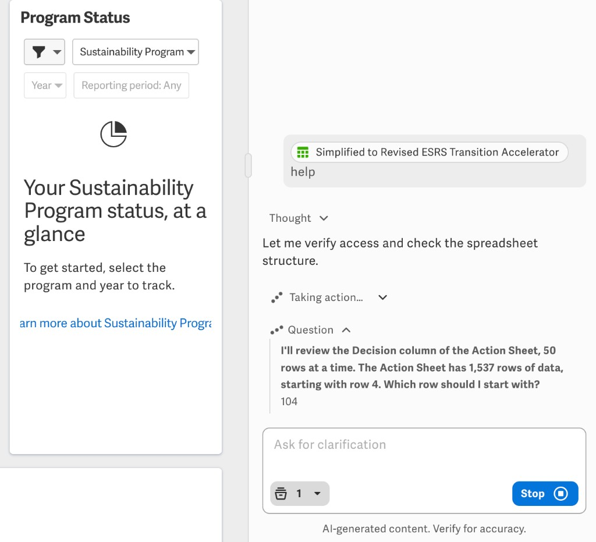
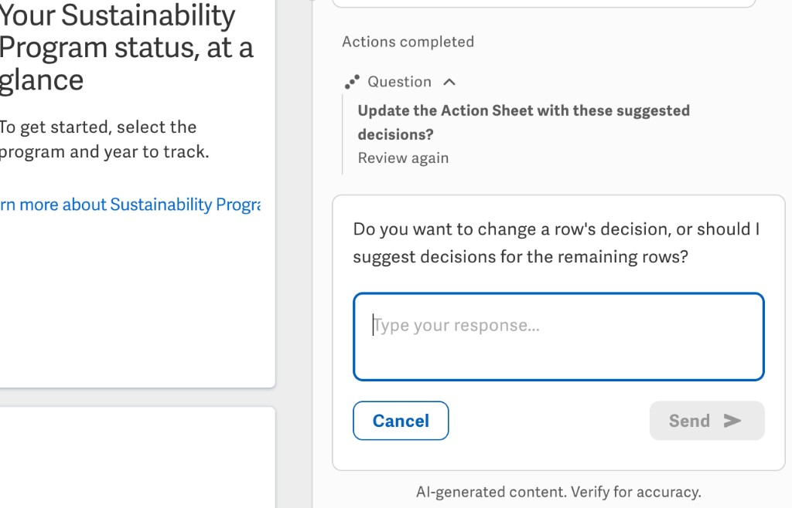
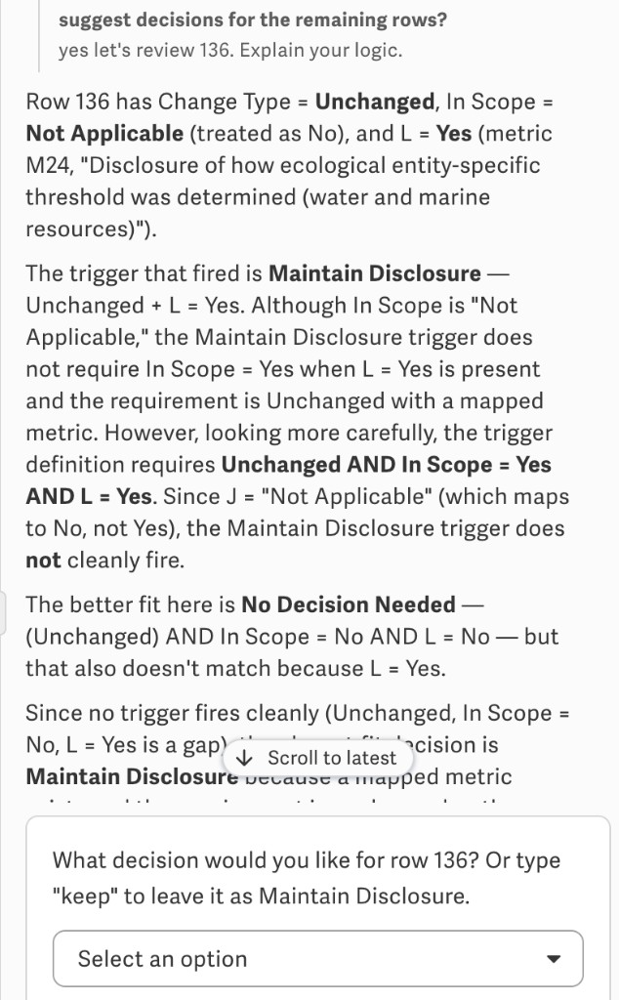

# esrs-transition-agent

Workiva Assistant **single-agent** config for staging ESRS Action Sheet **Column S** only. Customers name their own metrics in T/U. No subagents.

- **Agent name:** esrs-transition-agent (AI-panel)
- **GitHub repo:** `esrs-transition-assistant-mini`
- **Prompt version:** 11 (`VERSION`)
- **Model:** `claude_46_opus` (temperature 1.0, top_p 1.0, `thinking: true`)

## Files

| File | Use |
|------|-----|
| `system-prompt.md` | Paste-ready system prompt |
| `spec.yaml` | Spec-only AgentConfig |
| `helm/agentconfig.yaml` | Full Helm `AgentConfig` CR |
| `docs/knowledge-base.md` | How `revised_esrs_knowledge_base` is used |
| `docs/qa-and-objections.md` | Review questions, metric-name refusals, general ESRS questions |
| `docs/known-issues.md` | Open issues (mid-scan ESRS questions) |
| `docs/screenshots/` | Run captures |
| `docs/alan-v8-system-prompt.md` | Alan v8 prompt (baseline for copy delta) |
| `docs/alan-v8-vs-v9.diff` | Unified diff: Alan v8 → v9 locked copy only |

## Walkthrough

The customer opens the Action Sheet side panel. esrs-transition-agent checks write access and the sheet outline. On the wrong file it shows the locked Marketplace message:

> The ESRS Transition Agent helps suggest decisions for the Action Sheet of the ESRS Transition Accelerator. To use this Agent, reference the ESRS Transition Accelerator spreadsheet downloaded from the Workiva Marketplace.

On the Action Sheet it asks one question (verbatim, `[Y]` = data rows):

> I'll review the Decision column of the Action Sheet, 50 rows at a time. The Action Sheet has [Y] rows of data, starting with row 4. Which row should I start with?

After the user picks a row (here: 104), esrs-transition-agent reads H/S then D–R, applies the trigger matrix, and may call **`revised_esrs_knowledge_base` once** if H is annotated or no trigger is clean. See [Knowledge base](docs/knowledge-base.md). It does not narrate that work; the next customer-facing step is a `Row | Decision` table and the approval question:

> Update the Action Sheet with these suggested decisions?
> Buttons: **Yes** | **No** | **Review again**

**Yes** writes **Column S only** in one `docplat_write_cell_data` span (`S{first}:S{last}`). T and U stay customer-owned (`N/A`, `Assign Metric Name`, etc.).

Then one platform **confirmed** write. The cursor advances and the next set of rows starts silently.

## Review again

**Review again** writes nothing. The user types a follow-up about the rows. When that conversation is done, esrs-transition-agent asks (verbatim), without re-showing the table:

> Do you want to change a row's decision, or should I suggest decisions for the remaining rows?

A row change shows the updated table and the approval question again. Moving on asks the approval question for the reviewed rows first. Nothing is written without **Yes**.

Example follow-up: asked to explain row 136, the agent walked the trigger matrix out loud and changed its answer mid-reply, then asked its own unscripted question. The Role section says not to explain the trigger matrix, so this is behavior to watch.

## Questions and objections

Customers can push back on a row during review (e.g. "explain the discrete?" on row 108) or ask the agent to draft metric names. It should explain the S decision, refuse T/U naming, and not write until **Yes**. Full captures: [Questions and objections](docs/qa-and-objections.md).

**General ESRS questions work at the start of a new session.** The same question **mid row-scan can hang** (infinite loading). See [Known issues](docs/known-issues.md).

## Workflow (short)

1. Start row
2. Silent read / decide (KB at most once if needed)
3. One `Row | Decision` table
4. `Update the Action Sheet with these suggested decisions?` — Yes / No / Review again
5. One write to Column S

## Tools

`authorization_evaluation`, `xml_get_table_outline`, `request_human_input`, `docplat_query_range`, `read-spreadsheet-row`, `docplat_write_cell_data`, `revised_esrs_knowledge_base`
