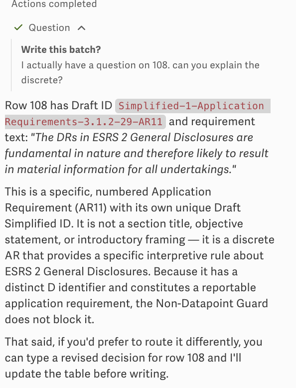
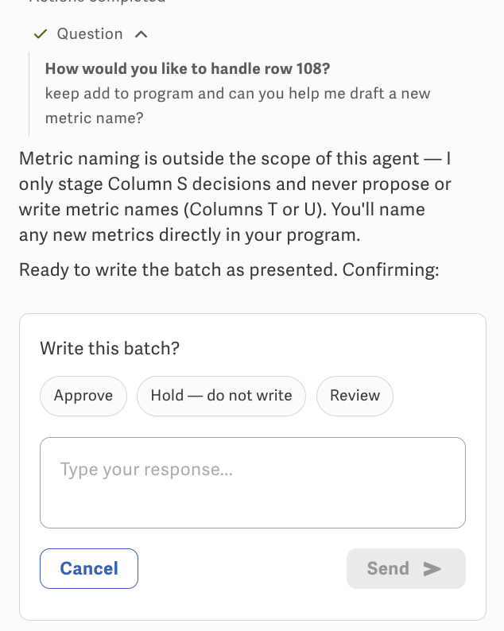
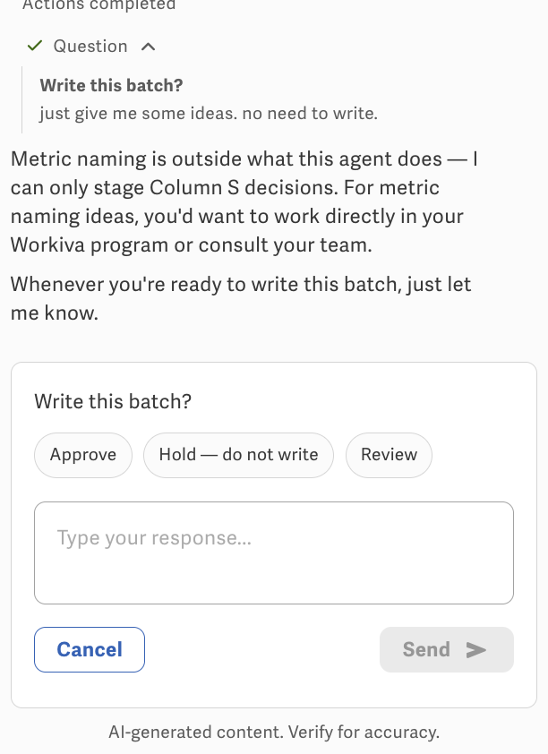
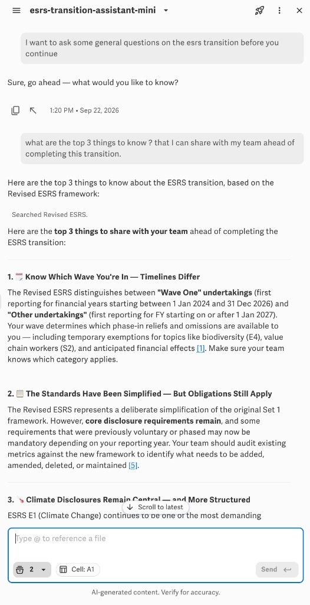

# Questions and objections

Mini is a **Column S staging** agent. Customers will still ask why a row was classified, or ask for metric names, or ask general ESRS questions. Captured v2 behavior:

## In-batch objection (row 108 — “discrete?”)

On `Write this batch?` they can type instead of Approve — e.g. explain the Non-Datapoint Guard for row 108.

Mini answered from Column D/E (numbered AR with a Draft ID ≠ section header / objective framing). It offered to change the decision before write. That is the intended **Review** path: explain, optionally edit S, then return to `Write this batch?`.

## Metric naming (out of scope)

If they keep Add to Program but ask Mini to draft a metric name:

Correct: Mini does **not** write T/U or invent names. They name metrics in the program.

Same if they say “just give me some ideas, no need to write”:

It should not write the batch. It may re-show Approve / Hold / Review. Hold or waiting is right; inventing T strings is not.

## General ESRS Q (works at session start)

A **new** chat (or before start-row / first scan) can take off-workflow questions. Mini called **Revised ESRS** and answered (waves, simplification, E1, citations).

That is a valid use of `revised_esrs_knowledge_base` **outside** the batch loop.

## Known issue: mid-scan general Q hangs

The same kind of non-workflow question **after** the agent is deep in row scan / approval **does not** complete reliably. The panel sits in an infinite loading loop (spinner, no answer, no return to `Write this batch?`).

Until that is fixed:

- General / team briefing questions → **new session** (or before Gate start row).
- In-batch → only row objections and S decision edits (Review). Do not ask Mini to switch into open Q&A mid-batch.

Likely cause: `max_iterations` + silent Step 4–5 + `request_human_input` still open, so a free-text detour never finishes the tool loop. Not a missing FAQ in the prompt.
